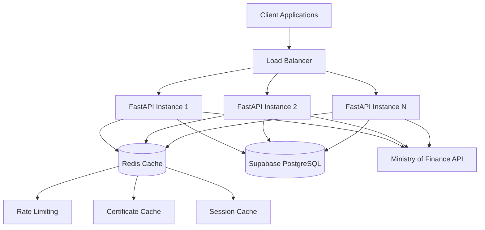

# Design Document - API de Facturación Electrónica Costa Rica

## Overview

This document outlines the technical design for a multi-tenant REST API that generates and sends electronic invoices compliant with Costa Rica's Ministry of Finance regulations. The system uses FastAPI with PostgreSQL (Supabase) as the primary database, Redis for caching and rate limiting, and integrates with Costa Rica's official electronic invoice system.

The API follows a stateless, microservices-oriented architecture that can scale horizontally to serve multiple tenants simultaneously while maintaining strict data isolation and security requirements.

## Architecture

### High-Level Architecture



### Technology Stack

- **API Framework**: FastAPI 0.104.1 with Python 3.11+
- **Database**: PostgreSQL 15 via Supabase with SQLAlchemy 2.0.23
- **Cache Layer**: Redis 7 for sessions, rate limiting, and certificate caching
- **Data Validation**: Pydantic 2.5.0 for request/response models
- **Authentication**: API Keys per tenant with optional JWT support
- **Database Migrations**: Alembic 1.13.0
- **XML Processing**: lxml 4.9.3 for generation and validation
- **XSD Validation**: xmlschema 2.5.1 for Ministry schema compliance
- **Cryptography**: cryptography 41.0.7 for P12 certificate handling
- **JWT Handling**: python-jose[cryptography] 3.3.0
- **Password Hashing**: bcrypt 4.1.2

### Deployment Architecture

- **Containerization**: Docker containers for API instances
- **Database**: Supabase managed PostgreSQL with connection pooling
- **Cache**: Redis cluster for high availability
- **Load Balancing**: Application-level load balancer
- **Monitoring**: Structured logging with correlation IDs
- **Security**: TLS termination at load balancer level

## Components and Interfaces

### Core Components

#### 1. Authentication Layer
```python
class AuthenticationService:
    def validate_api_key(self, api_key: str) -> Optional[Tenant]
    def generate_jwt_token(self, tenant_id: UUID) -> str
    def validate_jwt_token(self, token: str) -> Optional[dict]
    def check_rate_limit(self, tenant_id: UUID) -> bool
```

#### 2. Tenant Management Service
```python
class TenantService:
    def create_tenant(self, tenant_data: TenantCreate) -> Tenant
    def get_tenant(self, tenant_id: UUID) -> Optional[Tenant]
    def update_tenant(self, tenant_id: UUID, updates: TenantUpdate) -> Tenant
    def upload_certificate(self, tenant_id: UUID, p12_data: bytes, password: str) -> bool
    def validate_certificate(self, tenant_id: UUID) -> CertificateStatus
```

#### 3. Invoice Generation Service
```python
class InvoiceService:
    def create_invoice(self, tenant_id: UUID, invoice_data: InvoiceCreate) -> Invoice
    def generate_xml(self, invoice: Invoice) -> str
    def sign_xml(self, xml: str, certificate: bytes, password: str) -> str
    def validate_xml_schema(self, xml: str) -> ValidationResult
    def send_to_ministry(self, signed_xml: str) -> MinistryResponse
    def get_invoice(self, invoice_id: UUID, tenant_id: UUID) -> Optional[Invoice]
    def list_invoices(self, tenant_id: UUID, filters: InvoiceFilters) -> PaginatedInvoices
```

#### 4. CABYS Code Service
```python
class CabysService:
    def search_codes(self, query: str, limit: int = 20) -> List[CabysCode]
    def get_code(self, code: str) -> Optional[CabysCode]
    def validate_code(self, code: str) -> bool
    def update_database(self) -> UpdateResult
```

#### 5. Ministry Integration Service
```python
class MinistryService:
    def send_invoice(self, xml: str, environment: str = "development") -> MinistryResponse
    def check_invoice_status(self, invoice_key: str) -> InvoiceStatus
    def handle_response(self, response: MinistryResponse) -> ProcessingResult
    def retry_failed_invoice(self, invoice_id: UUID) -> RetryResult
```

### API Layer Structure

#### FastAPI Application Structure
```python
app/
├── main.py                 # FastAPI application entry point
├── core/
│   ├── config.py          # Configuration management
│   ├── security.py        # Authentication and security utilities
│   ├── database.py        # Database connection and session management
│   └── redis.py           # Redis connection and utilities
├── api/
│   ├── v1/
│   │   ├── endpoints/
│   │   │   ├── auth.py    # Authentication endpoints
│   │   │   ├── tenants.py # Tenant management endpoints
│   │   │   ├── invoices.py # Invoice CRUD endpoints
│   │   │   ├── cabys.py   # CABYS code search endpoints
│   │   │   └── utils.py   # Utility endpoints
│   │   └── api.py         # API router aggregation
├── models/
│   ├── database.py        # SQLAlchemy models
│   └── schemas.py         # Pydantic models
├── services/
│   ├── tenant_service.py
│   ├── invoice_service.py
│   ├── cabys_service.py
│   ├── ministry_service.py
│   └── xml_service.py
├── utils/
│   ├── xml_generator.py   # XML generation utilities
│   ├── crypto_utils.py    # Cryptography utilities
│   ├── validators.py      # Custom validators
│   └── formatters.py      # Data formatting utilities
└── tests/
    ├── unit/
    ├── integration/
    └── fixtures/
```

## Data Models

### Database Schema Design

#### Tenants Table
```sql
CREATE TABLE tenants (
    id UUID PRIMARY KEY DEFAULT gen_random_uuid(),
    nombre_empresa VARCHAR(255) NOT NULL,
    cedula_juridica VARCHAR(20) NOT NULL UNIQUE,
    api_key VARCHAR(64) NOT NULL UNIQUE,
    certificado_p12 BYTEA, -- Encrypted P12 certificate
    password_certificado TEXT, -- Encrypted password
    email_contacto VARCHAR(255) NOT NULL,
    activo BOOLEAN DEFAULT true,
    plan VARCHAR(20) DEFAULT 'basico',
    limite_facturas_mes INTEGER DEFAULT 100,
    facturas_usadas_mes INTEGER DEFAULT 0,
    created_at TIMESTAMP WITH TIME ZONE DEFAULT NOW(),
    updated_at TIMESTAMP WITH TIME ZONE DEFAULT NOW()
);

CREATE INDEX idx_tenants_api_key ON tenants(api_key);
CREATE INDEX idx_tenants_cedula ON tenants(cedula_juridica);
```

#### Invoices Table
```sql
CREATE TABLE facturas (
    id UUID PRIMARY KEY DEFAULT gen_random_uuid(),
    tenant_id UUID NOT NULL REFERENCES tenants(id) ON DELETE CASCADE,
    numero_consecutivo VARCHAR(20) NOT NULL,
    clave VARCHAR(50) NOT NULL UNIQUE,
    fecha_emision TIMESTAMP WITH TIME ZONE NOT NULL,
    receptor_nombre VARCHAR(255) NOT NULL,
    receptor_cedula VARCHAR(20) NOT NULL,
    receptor_email VARCHAR(255),
    xml_original TEXT NOT NULL,
    xml_firmado TEXT,
    estado VARCHAR(20) DEFAULT 'pendiente',
    monto_total DECIMAL(15,5) NOT NULL,
    mensaje_hacienda TEXT,
    created_at TIMESTAMP WITH TIME ZONE DEFAULT NOW(),
    updated_at TIMESTAMP WITH TIME ZONE DEFAULT NOW()
);

CREATE INDEX idx_facturas_tenant_id ON facturas(tenant_id);
CREATE INDEX idx_facturas_clave ON facturas(clave);
CREATE INDEX idx_facturas_estado ON facturas(estado);
CREATE INDEX idx_facturas_fecha ON facturas(fecha_emision);
```

#### Invoice Details Table
```sql
CREATE TABLE detalle_facturas (
    id UUID PRIMARY KEY DEFAULT gen_random_uuid(),
    factura_id UUID NOT NULL REFERENCES facturas(id) ON DELETE CASCADE,
    numero_linea INTEGER NOT NULL,
    codigo_cabys VARCHAR(13) NOT NULL,
    descripcion TEXT NOT NULL,
    cantidad DECIMAL(15,5) NOT NULL,
    precio_unitario DECIMAL(15,5) NOT NULL,
    monto_total DECIMAL(15,5) NOT NULL,
    impuesto_monto DECIMAL(15,5) NOT NULL,
    impuesto_tarifa DECIMAL(5,2) NOT NULL DEFAULT 13.00
);

CREATE INDEX idx_detalle_factura_id ON detalle_facturas(factura_id);
```

#### CABYS Codes Table
```sql
CREATE TABLE codigos_cabys (
    codigo VARCHAR(13) PRIMARY KEY,
    descripcion TEXT NOT NULL,
    categoria VARCHAR(255),
    activo BOOLEAN DEFAULT true,
    created_at TIMESTAMP WITH TIME ZONE DEFAULT NOW()
);

CREATE INDEX idx_cabys_descripcion ON codigos_cabys USING gin(to_tsvector('spanish', descripcion));
```

### Pydantic Models

#### Request/Response Models
```python
class TenantCreate(BaseModel):
    nombre_empresa: str = Field(..., max_length=255)
    cedula_juridica: str = Field(..., regex=r'^\d-\d{3}-\d{6}$')
    email_contacto: EmailStr
    plan: str = Field(default='basico', regex=r'^(basico|pro|empresa)$')

class InvoiceCreate(BaseModel):
    receptor: ReceptorData
    condicion_venta: str = Field(..., regex=r'^(01|02)$')
    medio_pago: str = Field(..., regex=r'^(01|02|03|04|05)$')
    detalles: List[InvoiceLineItem] = Field(..., min_items=1)

class InvoiceLineItem(BaseModel):
    codigo_cabys: str = Field(..., regex=r'^\d{13}$')
    descripcion: str = Field(..., max_length=500)
    cantidad: Decimal = Field(..., gt=0, decimal_places=5)
    precio_unitario: Decimal = Field(..., gt=0, decimal_places=5)

class InvoiceResponse(BaseModel):
    id: UUID
    numero_consecutivo: str
    clave: str
    estado: str
    monto_total: Decimal
    fecha_emision: datetime
    xml_url: Optional[str]
```

## Error Handling

### Error Response Structure
```python
class APIError(BaseModel):
    success: bool = False
    error: ErrorDetail

class ErrorDetail(BaseModel):
    code: str
    message: str
    details: Optional[Dict[str, Any]] = None
    timestamp: datetime = Field(default_factory=datetime.utcnow)
```

### Error Categories

#### Validation Errors (400)
- Invalid cedula format
- Missing required fields
- Invalid CABYS codes
- Malformed request data

#### Authentication Errors (401)
- Invalid API key
- Expired JWT token
- Missing authentication headers

#### Authorization Errors (403)
- Rate limit exceeded
- Insufficient permissions
- Inactive tenant account

#### Business Logic Errors (422)
- Certificate expired or invalid
- Invoice limit exceeded
- Duplicate consecutive number

#### External Service Errors (502/503)
- Ministry of Finance API unavailable
- Invalid response from Ministry
- Network timeout errors

### Error Handling Strategy
```python
@app.exception_handler(ValidationError)
async def validation_exception_handler(request: Request, exc: ValidationError):
    return JSONResponse(
        status_code=400,
        content=APIError(
            error=ErrorDetail(
                code="VALIDATION_ERROR",
                message="Request validation failed",
                details={"errors": exc.errors()}
            )
        ).dict()
    )
```

## Testing Strategy

### Unit Testing
- **Models**: Test Pydantic model validation and SQLAlchemy model relationships
- **Services**: Mock external dependencies and test business logic
- **Utilities**: Test XML generation, validation, and cryptographic functions
- **Validators**: Test custom validation functions for cedulas, CABYS codes, etc.

### Integration Testing
- **Database**: Test database operations with real PostgreSQL instance
- **Redis**: Test caching and rate limiting functionality
- **API Endpoints**: Test complete request/response cycles
- **Ministry Integration**: Test with Ministry's development environment

### End-to-End Testing
- **Complete Invoice Flow**: From creation to Ministry submission
- **Multi-tenant Scenarios**: Test data isolation between tenants
- **Error Scenarios**: Test error handling and recovery
- **Performance Testing**: Load testing with multiple concurrent requests

### Test Data Management
```python
# Fixtures for testing
@pytest.fixture
def test_tenant():
    return TenantFactory.create(
        nombre_empresa="Test Company",
        cedula_juridica="3-101-123456",
        plan="basico"
    )

@pytest.fixture
def test_certificate():
    return generate_test_p12_certificate()

@pytest.fixture
def sample_invoice_data():
    return {
        "receptor": {
            "nombre": "Test Customer",
            "cedula": "1-2345-6789",
            "email": "test@example.com"
        },
        "detalles": [
            {
                "codigo_cabys": "4299901999900",
                "descripcion": "Test Product",
                "cantidad": 1.0,
                "precio_unitario": 1000.0
            }
        ]
    }
```

### Performance Requirements
- **Response Time**: < 3 seconds average for invoice creation
- **Throughput**: Support 200+ concurrent requests
- **Database**: Optimize queries with proper indexing
- **Caching**: Cache certificates and CABYS codes in Redis
- **Memory Usage**: Efficient XML processing without memory leaks

This design provides a robust, scalable foundation for the electronic invoicing API that meets all the specified requirements while maintaining security, performance, and compliance with Costa Rica's regulations.