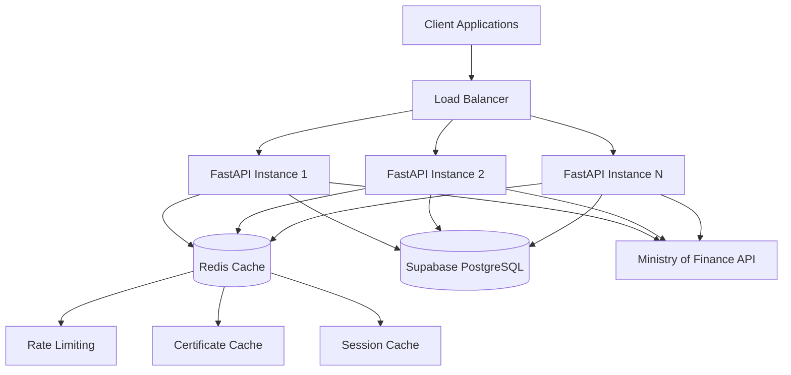

# Design Document - API de Facturación Electrónica Costa Rica

## Overview

This document outlines the technical design for a multi-tenant REST API that generates and sends electronic documents compliant with Costa Rica's Ministry of Finance regulations (Version 4.4). The system uses FastAPI with PostgreSQL (Supabase) as the primary database, Redis for caching and rate limiting, and integrates with Costa Rica's official electronic document system.

The API follows a stateless, microservices-oriented architecture that can scale horizontally to serve multiple tenants simultaneously while maintaining strict data isolation and security requirements. The system supports all 7 official document types defined by the Costa Rican tax authority and complies with UBL 2.1 standard with country-specific extensions.

## Architecture

### High-Level Architecture



### Technology Stack

- **API Framework**: FastAPI 0.104.1 with Python 3.11+
- **Database**: PostgreSQL 15 via Supabase with SQLAlchemy 2.0.23
- **Cache Layer**: Redis 7 for sessions, rate limiting, and certificate caching
- **Data Validation**: Pydantic 2.5.0 for request/response models
- **Authentication**: API Keys per tenant with optional JWT support
- **Database Migrations**: Alembic 1.13.0
- **XML Processing**: lxml 4.9.3 for generation and validation
- **XSD Validation**: xmlschema 2.5.1 for Ministry schema compliance
- **Cryptography**: cryptography 41.0.7 for P12 certificate handling
- **JWT Handling**: python-jose[cryptography] 3.3.0
- **Password Hashing**: bcrypt 4.1.2

### Deployment Architecture

- **Containerization**: Docker containers for API instances
- **Database**: Supabase managed PostgreSQL with connection pooling
- **Cache**: Redis cluster for high availability
- **Load Balancing**: Application-level load balancer
- **Monitoring**: Structured logging with correlation IDs
- **Security**: TLS termination at load balancer level

## Components and Interfaces

### Core Components

#### 1. Authentication Layer
```python
class AuthenticationService:
    def validate_api_key(self, api_key: str) -> Optional[Tenant]
    def generate_jwt_token(self, tenant_id: UUID) -> str
    def validate_jwt_token(self, token: str) -> Optional[dict]
    def check_rate_limit(self, tenant_id: UUID) -> bool
```

#### 2. Tenant Management Service
```python
class TenantService:
    def create_tenant(self, tenant_data: TenantCreate) -> Tenant
    def get_tenant(self, tenant_id: UUID) -> Optional[Tenant]
    def update_tenant(self, tenant_id: UUID, updates: TenantUpdate) -> Tenant
    def upload_certificate(self, tenant_id: UUID, p12_data: bytes, password: str) -> bool
    def validate_certificate(self, tenant_id: UUID) -> CertificateStatus
```

#### 3. Document Generation Service
```python
class DocumentType(Enum):
    FACTURA_ELECTRONICA = "01"
    NOTA_DEBITO_ELECTRONICA = "02"
    NOTA_CREDITO_ELECTRONICA = "03"
    TIQUETE_ELECTRONICO = "04"
    FACTURA_EXPORTACION = "05"
    FACTURA_COMPRA = "06"
    RECIBO_PAGO = "07"

class DocumentService:
    def create_document(self, tenant_id: UUID, doc_type: DocumentType, data: DocumentCreate) -> Document
    def generate_xml(self, document: Document) -> str
    def get_xsd_schema(self, doc_type: DocumentType) -> str
    def validate_xml_schema(self, xml: str, doc_type: DocumentType) -> ValidationResult
    def sign_xml(self, xml: str, certificate: bytes, password: str) -> str
    def send_to_ministry(self, signed_xml: str) -> MinistryResponse
    def get_document(self, document_id: UUID, tenant_id: UUID) -> Optional[Document]
    def list_documents(self, tenant_id: UUID, filters: DocumentFilters) -> PaginatedDocuments
    def create_document_reference(self, doc_id: UUID, ref_data: DocumentReference) -> DocumentReference
```

#### 4. CABYS Code Service
```python
class CabysService:
    def search_codes(self, query: str, limit: int = 20) -> List[CabysCode]
    def get_code(self, code: str) -> Optional[CabysCode]
    def validate_code(self, code: str) -> bool
    def update_database(self) -> UpdateResult
```

#### 5. Ministry Integration Service
```python
class MinistryService:
    def send_invoice(self, xml: str, environment: str = "development") -> MinistryResponse
    def check_invoice_status(self, invoice_key: str) -> InvoiceStatus
    def handle_response(self, response: MinistryResponse) -> ProcessingResult
    def retry_failed_invoice(self, invoice_id: UUID) -> RetryResult
```

### API Layer Structure

#### FastAPI Application Structure
```python
app/
├── main.py                 # FastAPI application entry point
├── core/
│   ├── config.py          # Configuration management
│   ├── security.py        # Authentication and security utilities
│   ├── database.py        # Database connection and session management
│   └── redis.py           # Redis connection and utilities
├── api/
│   ├── v1/
│   │   ├── endpoints/
│   │   │   ├── auth.py    # Authentication endpoints
│   │   │   ├── tenants.py # Tenant management endpoints
│   │   │   ├── invoices.py # Invoice CRUD endpoints
│   │   │   ├── cabys.py   # CABYS code search endpoints
│   │   │   └── utils.py   # Utility endpoints
│   │   └── api.py         # API router aggregation
├── models/
│   ├── database.py        # SQLAlchemy models
│   └── schemas.py         # Pydantic models
├── services/
│   ├── tenant_service.py
│   ├── invoice_service.py
│   ├── cabys_service.py
│   ├── ministry_service.py
│   └── xml_service.py
├── utils/
│   ├── xml_generator.py   # XML generation utilities
│   ├── crypto_utils.py    # Cryptography utilities
│   ├── validators.py      # Custom validators
│   └── formatters.py      # Data formatting utilities
└── tests/
    ├── unit/
    ├── integration/
    └── fixtures/
```

## Data Models

### Database Schema Design

#### Tenants Table
```sql
CREATE TABLE tenants (
    id UUID PRIMARY KEY DEFAULT gen_random_uuid(),
    nombre_empresa VARCHAR(255) NOT NULL,
    cedula_juridica VARCHAR(20) NOT NULL UNIQUE,
    api_key VARCHAR(64) NOT NULL UNIQUE,
    certificado_p12 BYTEA, -- Encrypted P12 certificate
    password_certificado TEXT, -- Encrypted password
    email_contacto VARCHAR(255) NOT NULL,
    activo BOOLEAN DEFAULT true,
    plan VARCHAR(20) DEFAULT 'basico',
    limite_facturas_mes INTEGER DEFAULT 100,
    facturas_usadas_mes INTEGER DEFAULT 0,
    created_at TIMESTAMP WITH TIME ZONE DEFAULT NOW(),
    updated_at TIMESTAMP WITH TIME ZONE DEFAULT NOW()
);

CREATE INDEX idx_tenants_api_key ON tenants(api_key);
CREATE INDEX idx_tenants_cedula ON tenants(cedula_juridica);
```

#### Documents Table (Unified for all document types)
```sql
CREATE TABLE documentos (
    id UUID PRIMARY KEY DEFAULT gen_random_uuid(),
    tenant_id UUID NOT NULL REFERENCES tenants(id) ON DELETE CASCADE,
    tipo_documento VARCHAR(2) NOT NULL, -- 01=Factura, 02=NotaDebito, 03=NotaCredito, 04=Tiquete, 05=FacturaExportacion, 06=FacturaCompra, 07=ReciboPago
    numero_consecutivo VARCHAR(20) NOT NULL, -- Format: \d{20,20}
    clave VARCHAR(50) NOT NULL UNIQUE, -- Format: \d{50,50}
    fecha_emision TIMESTAMP WITH TIME ZONE NOT NULL,
    
    -- Emisor information
    emisor_nombre VARCHAR(100) NOT NULL,
    emisor_tipo_identificacion VARCHAR(2) NOT NULL, -- 01-06
    emisor_numero_identificacion VARCHAR(20) NOT NULL,
    emisor_codigo_actividad VARCHAR(6),
    
    -- Receptor information (optional for some document types)
    receptor_nombre VARCHAR(100),
    receptor_tipo_identificacion VARCHAR(2),
    receptor_numero_identificacion VARCHAR(20),
    receptor_codigo_actividad VARCHAR(6),
    receptor_email VARCHAR(160),
    
    -- Transaction details
    condicion_venta VARCHAR(2) NOT NULL, -- 01-15, 99
    condicion_venta_otros VARCHAR(100), -- Required when condicion_venta = 99
    plazo_credito INTEGER, -- Required when credit sale
    medio_pago VARCHAR(2), -- 01-05, 99
    medio_pago_otros VARCHAR(100), -- Required when medio_pago = 99
    
    -- Currency and totals
    codigo_moneda VARCHAR(3) DEFAULT 'CRC',
    tipo_cambio DECIMAL(18,5) DEFAULT 1.0,
    total_venta_neta DECIMAL(18,5) NOT NULL,
    total_impuesto DECIMAL(18,5) NOT NULL DEFAULT 0,
    total_comprobante DECIMAL(18,5) NOT NULL,
    
    -- XML and processing
    xml_original TEXT NOT NULL,
    xml_firmado TEXT,
    xml_respuesta_hacienda TEXT,
    
    -- Status and tracking
    estado VARCHAR(20) DEFAULT 'pendiente', -- pendiente, enviado, aceptado, rechazado, error
    mensaje_hacienda TEXT,
    fecha_procesamiento TIMESTAMP WITH TIME ZONE,
    intentos_envio INTEGER DEFAULT 0,
    
    -- Audit fields
    created_at TIMESTAMP WITH TIME ZONE DEFAULT NOW(),
    updated_at TIMESTAMP WITH TIME ZONE DEFAULT NOW()
);

CREATE INDEX idx_documentos_tenant_id ON documentos(tenant_id);
CREATE INDEX idx_documentos_clave ON documentos(clave);
CREATE INDEX idx_documentos_tipo ON documentos(tipo_documento);
CREATE INDEX idx_documentos_estado ON documentos(estado);
CREATE INDEX idx_documentos_fecha ON documentos(fecha_emision);
CREATE INDEX idx_documentos_emisor ON documentos(emisor_numero_identificacion);
CREATE INDEX idx_documentos_receptor ON documentos(receptor_numero_identificacion);
```

#### Document Details Table
```sql
CREATE TABLE detalle_documentos (
    id UUID PRIMARY KEY DEFAULT gen_random_uuid(),
    documento_id UUID NOT NULL REFERENCES documentos(id) ON DELETE CASCADE,
    numero_linea INTEGER NOT NULL CHECK (numero_linea >= 1 AND numero_linea <= 1000),
    
    -- Product/Service identification
    codigo_cabys VARCHAR(13) NOT NULL, -- Exactly 13 digits
    descripcion TEXT NOT NULL CHECK (char_length(descripcion) >= 3 AND char_length(descripcion) <= 200),
    
    -- Quantities and measures
    cantidad DECIMAL(16,3) NOT NULL CHECK (cantidad > 0),
    unidad_medida VARCHAR(10) NOT NULL, -- From official units catalog
    unidad_medida_comercial VARCHAR(20),
    
    -- Pricing
    precio_unitario DECIMAL(18,5) NOT NULL CHECK (precio_unitario >= 0),
    monto_total DECIMAL(18,5) NOT NULL,
    monto_descuento DECIMAL(18,5) DEFAULT 0,
    naturaleza_descuento VARCHAR(80),
    
    -- Tax information
    impuesto_codigo VARCHAR(2) NOT NULL, -- 01=IVA, 02=Selectivo, etc.
    impuesto_codigo_tarifa VARCHAR(2), -- For IVA: 01-11
    impuesto_tarifa DECIMAL(4,2),
    impuesto_factor_iva DECIMAL(5,4), -- For used goods regime
    impuesto_monto DECIMAL(18,5) NOT NULL DEFAULT 0,
    
    -- Special fields
    tipo_transaccion VARCHAR(2), -- 01-13 for special tax treatments
    numero_vin_serie VARCHAR(17), -- For vehicles
    registro_medicamento VARCHAR(100), -- For pharmaceuticals
    forma_farmaceutica VARCHAR(3), -- For pharmaceuticals
    
    -- Commercial codes (up to 5 per line)
    codigos_comerciales JSONB, -- Array of {tipo, codigo} objects
    
    -- Package/combo details
    detalle_surtido JSONB, -- For package components
    
    created_at TIMESTAMP WITH TIME ZONE DEFAULT NOW()
);

CREATE INDEX idx_detalle_documento_id ON detalle_documentos(documento_id);
CREATE INDEX idx_detalle_cabys ON detalle_documentos(codigo_cabys);
CREATE INDEX idx_detalle_descripcion ON detalle_documentos USING gin(to_tsvector('spanish', descripcion));
```

#### CABYS Codes Table
```sql
CREATE TABLE codigos_cabys (
    codigo VARCHAR(13) PRIMARY KEY,
    descripcion TEXT NOT NULL,
    categoria VARCHAR(255),
    impuesto DECIMAL(4,2) DEFAULT 13.00, -- Default IVA rate
    activo BOOLEAN DEFAULT true,
    created_at TIMESTAMP WITH TIME ZONE DEFAULT NOW()
);

CREATE INDEX idx_cabys_descripcion ON codigos_cabys USING gin(to_tsvector('spanish', descripcion));
CREATE INDEX idx_cabys_categoria ON codigos_cabys(categoria);
```

#### Document References Table
```sql
CREATE TABLE referencias_documentos (
    id UUID PRIMARY KEY DEFAULT gen_random_uuid(),
    documento_id UUID NOT NULL REFERENCES documentos(id) ON DELETE CASCADE,
    tipo_documento_referencia VARCHAR(2) NOT NULL, -- 01-18 from TipoDocReferenciaType
    tipo_documento_otro VARCHAR(100), -- Required when tipo = 99
    numero_referencia VARCHAR(50), -- Key or consecutive of referenced document
    fecha_emision_referencia TIMESTAMP WITH TIME ZONE NOT NULL,
    codigo_referencia VARCHAR(2), -- 01-12, 99 from CodigoReferenciaType
    codigo_referencia_otro VARCHAR(100), -- Required when codigo = 99
    razon VARCHAR(180), -- Reason for reference
    created_at TIMESTAMP WITH TIME ZONE DEFAULT NOW()
);

CREATE INDEX idx_referencias_documento_id ON referencias_documentos(documento_id);
CREATE INDEX idx_referencias_numero ON referencias_documentos(numero_referencia);
```

#### Document Taxes Table
```sql
CREATE TABLE impuestos_documentos (
    id UUID PRIMARY KEY DEFAULT gen_random_uuid(),
    detalle_documento_id UUID NOT NULL REFERENCES detalle_documentos(id) ON DELETE CASCADE,
    codigo_impuesto VARCHAR(2) NOT NULL, -- 01=IVA, 02=Selectivo, etc.
    codigo_impuesto_otro VARCHAR(100), -- Required when codigo = 99
    codigo_tarifa_iva VARCHAR(2), -- 01-11 for IVA taxes
    tarifa DECIMAL(4,2), -- Tax rate percentage
    factor_calculo_iva DECIMAL(5,4), -- For used goods regime
    monto DECIMAL(18,5) NOT NULL,
    
    -- Specific tax data for non-tariff taxes (fuel, alcohol, etc.)
    cantidad_unidad_medida DECIMAL(7,2), -- For specific taxes
    porcentaje DECIMAL(4,2), -- For alcohol tax
    proporcion DECIMAL(5,2), -- For alcohol tax calculation
    volumen_unidad_consumo DECIMAL(7,2), -- For beverage tax
    impuesto_unidad DECIMAL(18,5), -- Unit tax amount
    
    created_at TIMESTAMP WITH TIME ZONE DEFAULT NOW()
);

CREATE INDEX idx_impuestos_detalle_id ON impuestos_documentos(detalle_documento_id);
CREATE INDEX idx_impuestos_codigo ON impuestos_documentos(codigo_impuesto);
```

#### Document Exemptions Table
```sql
CREATE TABLE exoneraciones_documentos (
    id UUID PRIMARY KEY DEFAULT gen_random_uuid(),
    impuesto_documento_id UUID NOT NULL REFERENCES impuestos_documentos(id) ON DELETE CASCADE,
    tipo_documento_exoneracion VARCHAR(2) NOT NULL, -- 01-11, 99
    tipo_documento_otro VARCHAR(100), -- Required when tipo = 99
    numero_documento VARCHAR(40) NOT NULL,
    articulo INTEGER, -- Article number
    inciso INTEGER, -- Subsection number
    nombre_institucion VARCHAR(2) NOT NULL, -- 01-12, 99
    nombre_institucion_otros VARCHAR(160), -- Required when institucion = 99
    fecha_emision TIMESTAMP WITH TIME ZONE NOT NULL,
    tarifa_exonerada DECIMAL(4,2) NOT NULL,
    monto_exoneracion DECIMAL(18,5) NOT NULL,
    created_at TIMESTAMP WITH TIME ZONE DEFAULT NOW()
);

CREATE INDEX idx_exoneraciones_impuesto_id ON exoneraciones_documentos(impuesto_documento_id);
CREATE INDEX idx_exoneraciones_numero ON exoneraciones_documentos(numero_documento);
```

#### Document Other Charges Table
```sql
CREATE TABLE otros_cargos_documentos (
    id UUID PRIMARY KEY DEFAULT gen_random_uuid(),
    documento_id UUID NOT NULL REFERENCES documentos(id) ON DELETE CASCADE,
    tipo_documento VARCHAR(2) NOT NULL, -- 01-10, 99
    tipo_documento_otros VARCHAR(100), -- Required when tipo = 99
    
    -- Third party information (optional)
    tercero_tipo_identificacion VARCHAR(2),
    tercero_numero_identificacion VARCHAR(20),
    tercero_nombre VARCHAR(100),
    
    detalle VARCHAR(160) NOT NULL,
    porcentaje DECIMAL(9,5), -- Percentage for calculation
    monto_cargo DECIMAL(18,5) NOT NULL,
    created_at TIMESTAMP WITH TIME ZONE DEFAULT NOW()
);

CREATE INDEX idx_otros_cargos_documento_id ON otros_cargos_documentos(documento_id);
```

#### Receptor Messages Table
```sql
CREATE TABLE mensajes_receptor (
    id UUID PRIMARY KEY DEFAULT gen_random_uuid(),
    documento_id UUID NOT NULL REFERENCES documentos(id),
    clave_documento VARCHAR(50) NOT NULL, -- Original document key
    cedula_emisor VARCHAR(12) NOT NULL, -- Issuer identification
    fecha_emision TIMESTAMP WITH TIME ZONE NOT NULL,
    mensaje INTEGER NOT NULL CHECK (mensaje IN (1, 2, 3)), -- 1=Accepted, 2=Partial, 3=Rejected
    detalle_mensaje VARCHAR(160), -- Optional rejection details
    monto_total_impuesto DECIMAL(18,5), -- For validation
    codigo_actividad VARCHAR(6), -- Economic activity code
    condicion_impuesto VARCHAR(2), -- 01-05 IVA condition
    xml_mensaje TEXT, -- Generated XML message
    xml_firmado TEXT, -- Signed XML message
    enviado BOOLEAN DEFAULT false,
    created_at TIMESTAMP WITH TIME ZONE DEFAULT NOW()
);

CREATE INDEX idx_mensajes_documento_id ON mensajes_receptor(documento_id);
CREATE INDEX idx_mensajes_clave ON mensajes_receptor(clave_documento);
```

#### Geographic Locations Table (Costa Rica specific)
```sql
CREATE TABLE ubicaciones_cr (
    id SERIAL PRIMARY KEY,
    provincia INTEGER NOT NULL CHECK (provincia >= 1 AND provincia <= 7),
    canton INTEGER NOT NULL CHECK (canton >= 1 AND canton <= 99),
    distrito INTEGER NOT NULL CHECK (distrito >= 1 AND distrito <= 99),
    nombre_provincia VARCHAR(50) NOT NULL,
    nombre_canton VARCHAR(100) NOT NULL,
    nombre_distrito VARCHAR(100) NOT NULL,
    activo BOOLEAN DEFAULT true,
    UNIQUE(provincia, canton, distrito)
);

CREATE INDEX idx_ubicaciones_provincia ON ubicaciones_cr(provincia);
CREATE INDEX idx_ubicaciones_canton ON ubicaciones_cr(provincia, canton);
```

#### Units of Measure Table
```sql
CREATE TABLE unidades_medida (
    codigo VARCHAR(10) PRIMARY KEY,
    descripcion VARCHAR(200) NOT NULL,
    categoria VARCHAR(50), -- metric, commercial, service, etc.
    activo BOOLEAN DEFAULT true
);

-- Insert all official units from RTC 443:2010 standard
INSERT INTO unidades_medida (codigo, descripcion, categoria) VALUES
('Unid', 'Unidad', 'commercial'),
('Kg', 'Kilogramo', 'metric'),
('L', 'Litro', 'metric'),
('m', 'Metro', 'metric'),
('m²', 'Metro cuadrado', 'metric'),
('m³', 'Metro cúbico', 'metric'),
('h', 'Hora', 'time'),
('Sp', 'Servicios Profesionales', 'service'),
('St', 'Servicios técnicos', 'service'),
-- ... (over 100 more units from the XSD)
;
```

### Pydantic Models

#### Core Enums and Types
```python
class DocumentType(str, Enum):
    FACTURA_ELECTRONICA = "01"
    NOTA_DEBITO_ELECTRONICA = "02"
    NOTA_CREDITO_ELECTRONICA = "03"
    TIQUETE_ELECTRONICO = "04"
    FACTURA_EXPORTACION = "05"
    FACTURA_COMPRA = "06"
    RECIBO_PAGO = "07"

class IdentificationType(str, Enum):
    CEDULA_FISICA = "01"
    CEDULA_JURIDICA = "02"
    DIMEX = "03"
    NITE = "04"
    EXTRANJERO_NO_DOMICILIADO = "05"
    NO_CONTRIBUYENTE = "06"

class SaleCondition(str, Enum):
    CONTADO = "01"
    CREDITO = "02"
    CONSIGNACION = "03"
    APARTADO = "04"
    ARRENDAMIENTO_OPCION_COMPRA = "05"
    ARRENDAMIENTO_FUNCION_FINANCIERA = "06"
    COBRO_TERCERO = "07"
    SERVICIOS_ESTADO_CREDITO = "08"
    VENTA_CREDITO_90_DIAS = "10"
    VENTA_MERCANCIA_NO_NACIONALIZADA = "12"
    VENTA_BIENES_USADOS_NO_CONTRIBUYENTE = "13"
    ARRENDAMIENTO_OPERATIVO = "14"
    ARRENDAMIENTO_FINANCIERO = "15"
    OTROS = "99"

class PaymentMethod(str, Enum):
    EFECTIVO = "01"
    TARJETA = "02"
    CHEQUE = "03"
    TRANSFERENCIA = "04"
    RECAUDADO_TERCERO = "05"
    OTROS = "99"

class TaxCode(str, Enum):
    IVA = "01"
    SELECTIVO_CONSUMO = "02"
    UNICO_COMBUSTIBLES = "03"
    ESPECIFICO_BEBIDAS_ALCOHOLICAS = "04"
    ESPECIFICO_BEBIDAS_SIN_ALCOHOL = "05"
    PRODUCTOS_TABACO = "06"
    IVA_CALCULO_ESPECIAL = "07"
    IVA_BIENES_USADOS = "08"
    ESPECIFICO_CEMENTO = "12"
    OTROS = "99"

class IVATariffCode(str, Enum):
    TARIFA_0_PERCENT = "01"
    TARIFA_REDUCIDA_1_PERCENT = "02"
    TARIFA_REDUCIDA_2_PERCENT = "03"
    TARIFA_REDUCIDA_4_PERCENT = "04"
    TRANSITORIO_0_PERCENT = "05"
    TRANSITORIO_4_PERCENT = "06"
    TRANSITORIO_8_PERCENT = "07"
    TARIFA_GENERAL_13_PERCENT = "08"
    TARIFA_REDUCIDA_0_5_PERCENT = "09"
    TARIFA_EXENTA = "10"
    TARIFA_0_SIN_CREDITO = "11"
```

#### Base Models
```python
class IdentificationData(BaseModel):
    tipo: IdentificationType
    numero: str = Field(..., max_length=20)

    @validator('numero')
    def validate_identification_number(cls, v, values):
        tipo = values.get('tipo')
        if tipo == IdentificationType.CEDULA_FISICA:
            # Validate physical ID format: 1-2345-6789
            if not re.match(r'^\d-\d{4}-\d{4}$', v):
                raise ValueError('Invalid physical ID format')
        elif tipo == IdentificationType.CEDULA_JURIDICA:
            # Validate legal ID format: 3-101-123456
            if not re.match(r'^\d-\d{3}-\d{6}$', v):
                raise ValueError('Invalid legal ID format')
        return v

class LocationData(BaseModel):
    provincia: int = Field(..., ge=1, le=7)
    canton: int = Field(..., ge=1, le=99)
    distrito: int = Field(..., ge=1, le=99)
    barrio: Optional[str] = Field(None, min_length=5, max_length=50)
    otras_senas: str = Field(..., min_length=5, max_length=250)

class PhoneData(BaseModel):
    codigo_pais: int = Field(..., ge=1, le=999)
    numero: int = Field(..., ge=10000000, le=99999999999999999999)

class EmisorData(BaseModel):
    nombre: str = Field(..., min_length=5, max_length=100)
    identificacion: IdentificationData
    nombre_comercial: Optional[str] = Field(None, min_length=3, max_length=80)
    ubicacion: LocationData
    telefono: Optional[PhoneData] = None
    correo_electronico: List[EmailStr] = Field(..., min_items=1, max_items=4)
    codigo_actividad: str = Field(..., min_length=6, max_length=6)

class ReceptorData(BaseModel):
    nombre: str = Field(..., min_length=3, max_length=100)
    identificacion: Optional[IdentificationData] = None  # Optional for tickets
    nombre_comercial: Optional[str] = Field(None, min_length=3, max_length=80)
    ubicacion: Optional[LocationData] = None
    otras_senas_extranjero: Optional[str] = Field(None, min_length=5, max_length=300)
    telefono: Optional[PhoneData] = None
    correo_electronico: Optional[EmailStr] = None
    codigo_actividad: Optional[str] = Field(None, min_length=6, max_length=6)
```

#### Document Line Items
```python
class CommercialCode(BaseModel):
    tipo: str = Field(..., regex=r'^(01|02|03|04|99)$')  # Seller, Buyer, Industry, Internal, Others
    codigo: str = Field(..., max_length=20)

class PackageComponent(BaseModel):
    codigo_cabys: str = Field(..., regex=r'^\d{13}$')
    cantidad: Decimal = Field(..., gt=0, max_digits=16, decimal_places=3)
    unidad_medida: str = Field(..., max_length=10)
    descripcion: str = Field(..., min_length=3, max_length=200)

class TaxData(BaseModel):
    codigo: TaxCode
    codigo_impuesto_otro: Optional[str] = Field(None, min_length=5, max_length=100)
    codigo_tarifa_iva: Optional[IVATariffCode] = None
    tarifa: Optional[Decimal] = Field(None, max_digits=4, decimal_places=2)
    factor_calculo_iva: Optional[Decimal] = Field(None, max_digits=5, decimal_places=4)
    monto: Decimal = Field(..., max_digits=18, decimal_places=5)
    
    # Specific tax data for non-tariff taxes
    cantidad_unidad_medida: Optional[Decimal] = Field(None, max_digits=7, decimal_places=2)
    porcentaje: Optional[Decimal] = Field(None, max_digits=4, decimal_places=2)
    proporcion: Optional[Decimal] = Field(None, max_digits=5, decimal_places=2)
    volumen_unidad_consumo: Optional[Decimal] = Field(None, max_digits=7, decimal_places=2)
    impuesto_unidad: Optional[Decimal] = Field(None, max_digits=18, decimal_places=5)

class ExemptionData(BaseModel):
    tipo_documento: str = Field(..., regex=r'^(01|02|03|04|05|06|07|08|09|10|11|99)$')
    tipo_documento_otro: Optional[str] = Field(None, min_length=5, max_length=100)
    numero_documento: str = Field(..., min_length=3, max_length=40)
    articulo: Optional[int] = Field(None, le=999999)
    inciso: Optional[int] = Field(None, le=999999)
    nombre_institucion: str = Field(..., regex=r'^(01|02|03|04|05|06|07|08|09|10|11|12|99)$')
    nombre_institucion_otros: Optional[str] = Field(None, min_length=5, max_length=160)
    fecha_emision: datetime
    tarifa_exonerada: Decimal = Field(..., max_digits=4, decimal_places=2)
    monto_exoneracion: Decimal = Field(..., max_digits=18, decimal_places=5)

class DiscountData(BaseModel):
    monto_descuento: Decimal = Field(..., max_digits=18, decimal_places=5)
    codigo_descuento: str = Field(..., regex=r'^(01|02|03|04|05|06|07|08|09|99)$')
    codigo_descuento_otro: Optional[str] = Field(None, min_length=5, max_length=100)
    naturaleza_descuento: Optional[str] = Field(None, min_length=3, max_length=80)

class DocumentLineItem(BaseModel):
    numero_linea: int = Field(..., ge=1, le=1000)
    codigo_cabys: str = Field(..., regex=r'^\d{13}$')
    codigos_comerciales: Optional[List[CommercialCode]] = Field(None, max_items=5)
    cantidad: Decimal = Field(..., gt=0, max_digits=16, decimal_places=3)
    unidad_medida: str = Field(..., max_length=10)
    unidad_medida_comercial: Optional[str] = Field(None, max_length=20)
    descripcion: str = Field(..., min_length=3, max_length=200)
    precio_unitario: Decimal = Field(..., ge=0, max_digits=18, decimal_places=5)
    monto_total: Decimal = Field(..., max_digits=18, decimal_places=5)
    
    # Special product fields
    tipo_transaccion: Optional[str] = Field(None, regex=r'^(01|02|03|04|05|06|07|08|09|10|11|12|13)$')
    numero_vin_serie: Optional[str] = Field(None, max_length=17)
    registro_medicamento: Optional[str] = Field(None, max_length=100)
    forma_farmaceutica: Optional[str] = Field(None, max_length=3)
    
    # Package/combo components
    detalle_surtido: Optional[List[PackageComponent]] = Field(None, max_items=20)
    
    # Discounts and taxes
    descuento: Optional[DiscountData] = None
    impuestos: List[TaxData] = Field(..., min_items=1)
```

#### Document References
```python
class DocumentReference(BaseModel):
    tipo_documento: str = Field(..., regex=r'^(01|02|03|04|05|06|07|08|09|10|11|12|13|14|15|16|17|18|99)$')
    tipo_documento_otro: Optional[str] = Field(None, min_length=5, max_length=100)
    numero: Optional[str] = Field(None, max_length=50)
    fecha_emision: datetime
    codigo: Optional[str] = Field(None, regex=r'^(01|02|04|05|06|07|08|09|10|11|12|99)$')
    codigo_referencia_otro: Optional[str] = Field(None, min_length=5, max_length=100)
    razon: Optional[str] = Field(None, max_length=180)
```

#### Other Charges
```python
class OtherCharge(BaseModel):
    tipo_documento: str = Field(..., regex=r'^(01|02|03|04|05|06|07|08|09|10|99)$')
    tipo_documento_otros: Optional[str] = Field(None, min_length=5, max_length=100)
    
    # Third party information
    tercero_identificacion: Optional[IdentificationData] = None
    tercero_nombre: Optional[str] = Field(None, min_length=5, max_length=100)
    
    detalle: str = Field(..., max_length=160)
    porcentaje: Optional[Decimal] = Field(None, max_digits=9, decimal_places=5, ge=0)
    monto_cargo: Decimal = Field(..., max_digits=18, decimal_places=5)
```

#### Main Document Models
```python
class DocumentCreate(BaseModel):
    tipo_documento: DocumentType
    emisor: EmisorData
    receptor: Optional[ReceptorData] = None  # Optional for some document types
    condicion_venta: SaleCondition
    condicion_venta_otros: Optional[str] = Field(None, min_length=5, max_length=100)
    plazo_credito: Optional[int] = Field(None, le=99999)
    medio_pago: PaymentMethod
    medio_pago_otros: Optional[str] = Field(None, min_length=3, max_length=100)
    
    # Currency information
    codigo_moneda: str = Field(default="CRC", max_length=3)
    tipo_cambio: Decimal = Field(default=Decimal("1.0"), max_digits=18, decimal_places=5)
    
    # Line items
    detalles: List[DocumentLineItem] = Field(..., min_items=1, max_items=1000)
    
    # References (for credit/debit notes)
    referencias: Optional[List[DocumentReference]] = Field(None, max_items=10)
    
    # Other charges
    otros_cargos: Optional[List[OtherCharge]] = None
    
    # Additional fields
    observaciones: Optional[str] = Field(None, max_length=500)

class DocumentResponse(BaseModel):
    id: UUID
    tipo_documento: DocumentType
    numero_consecutivo: str
    clave: str
    fecha_emision: datetime
    emisor_nombre: str
    receptor_nombre: Optional[str]
    estado: str
    total_venta_neta: Decimal
    total_impuesto: Decimal
    total_comprobante: Decimal
    codigo_moneda: str
    xml_url: Optional[str]
    pdf_url: Optional[str]
    created_at: datetime
    updated_at: datetime

class DocumentList(BaseModel):
    items: List[DocumentResponse]
    total: int
    page: int
    size: int
    pages: int

class DocumentFilters(BaseModel):
    tipo_documento: Optional[DocumentType] = None
    estado: Optional[str] = None
    fecha_desde: Optional[date] = None
    fecha_hasta: Optional[date] = None
    emisor_identificacion: Optional[str] = None
    receptor_identificacion: Optional[str] = None
    monto_minimo: Optional[Decimal] = None
    monto_maximo: Optional[Decimal] = None
```

#### Receptor Message Models
```python
class ReceptorMessageCreate(BaseModel):
    clave_documento: str = Field(..., regex=r'^\d{50}$')
    cedula_emisor: str = Field(..., regex=r'^\d{9,12}$')
    mensaje: int = Field(..., ge=1, le=3)  # 1=Accepted, 2=Partial, 3=Rejected
    detalle_mensaje: Optional[str] = Field(None, max_length=160)
    monto_total_impuesto: Optional[Decimal] = Field(None, max_digits=18, decimal_places=5)
    codigo_actividad: Optional[str] = Field(None, max_length=6)
    condicion_impuesto: Optional[str] = Field(None, regex=r'^(01|02|03|04|05)$')

class ReceptorMessageResponse(BaseModel):
    id: UUID
    clave_documento: str
    mensaje: int
    detalle_mensaje: Optional[str]
    xml_url: Optional[str]
    enviado: bool
    created_at: datetime
```

#### Tenant Models
```python
class TenantCreate(BaseModel):
    nombre_empresa: str = Field(..., min_length=5, max_length=255)
    cedula_juridica: str = Field(..., regex=r'^\d-\d{3}-\d{6}$')
    email_contacto: EmailStr
    plan: str = Field(default='basico', regex=r'^(basico|pro|empresa)$')

class TenantUpdate(BaseModel):
    nombre_empresa: Optional[str] = Field(None, min_length=5, max_length=255)
    email_contacto: Optional[EmailStr] = None
    plan: Optional[str] = Field(None, regex=r'^(basico|pro|empresa)$')
    activo: Optional[bool] = None

class TenantResponse(BaseModel):
    id: UUID
    nombre_empresa: str
    cedula_juridica: str
    email_contacto: str
    plan: str
    activo: bool
    limite_facturas_mes: int
    facturas_usadas_mes: int
    certificado_vigente: bool
    certificado_expira: Optional[date]
    created_at: datetime

class CertificateUpload(BaseModel):
    p12_data: bytes
    password: str = Field(..., min_length=1)
    
class CertificateStatus(BaseModel):
    vigente: bool
    fecha_expiracion: Optional[date]
    dias_restantes: Optional[int]
    emisor: Optional[str]
    numero_serie: Optional[str]
```

## Error Handling

### Error Response Structure
```python
class APIError(BaseModel):
    success: bool = False
    error: ErrorDetail

class ErrorDetail(BaseModel):
    code: str
    message: str
    details: Optional[Dict[str, Any]] = None
    timestamp: datetime = Field(default_factory=datetime.utcnow)
```

### Error Categories

#### Validation Errors (400)
- Invalid cedula format
- Missing required fields
- Invalid CABYS codes
- Malformed request data

#### Authentication Errors (401)
- Invalid API key
- Expired JWT token
- Missing authentication headers

#### Authorization Errors (403)
- Rate limit exceeded
- Insufficient permissions
- Inactive tenant account

#### Business Logic Errors (422)
- Certificate expired or invalid
- Invoice limit exceeded
- Duplicate consecutive number

#### External Service Errors (502/503)
- Ministry of Finance API unavailable
- Invalid response from Ministry
- Network timeout errors

### Error Handling Strategy
```python
@app.exception_handler(ValidationError)
async def validation_exception_handler(request: Request, exc: ValidationError):
    return JSONResponse(
        status_code=400,
        content=APIError(
            error=ErrorDetail(
                code="VALIDATION_ERROR",
                message="Request validation failed",
                details={"errors": exc.errors()}
            )
        ).dict()
    )
```

## Testing Strategy

### Unit Testing
- **Models**: Test Pydantic model validation and SQLAlchemy model relationships
- **Services**: Mock external dependencies and test business logic
- **Utilities**: Test XML generation, validation, and cryptographic functions
- **Validators**: Test custom validation functions for cedulas, CABYS codes, etc.

### Integration Testing
- **Database**: Test database operations with real PostgreSQL instance
- **Redis**: Test caching and rate limiting functionality
- **API Endpoints**: Test complete request/response cycles
- **Ministry Integration**: Test with Ministry's development environment

### End-to-End Testing
- **Complete Invoice Flow**: From creation to Ministry submission
- **Multi-tenant Scenarios**: Test data isolation between tenants
- **Error Scenarios**: Test error handling and recovery
- **Performance Testing**: Load testing with multiple concurrent requests

### Test Data Management
```python
# Fixtures for testing
@pytest.fixture
def test_tenant():
    return TenantFactory.create(
        nombre_empresa="Test Company",
        cedula_juridica="3-101-123456",
        plan="basico"
    )

@pytest.fixture
def test_certificate():
    return generate_test_p12_certificate()

@pytest.fixture
def sample_invoice_data():
    return {
        "receptor": {
            "nombre": "Test Customer",
            "cedula": "1-2345-6789",
            "email": "test@example.com"
        },
        "detalles": [
            {
                "codigo_cabys": "4299901999900",
                "descripcion": "Test Product",
                "cantidad": 1.0,
                "precio_unitario": 1000.0
            }
        ]
    }
```

### Performance Requirements
- **Response Time**: < 3 seconds average for invoice creation
- **Throughput**: Support 200+ concurrent requests
- **Database**: Optimize queries with proper indexing
- **Caching**: Cache certificates and CABYS codes in Redis
- **Memory Usage**: Efficient XML processing without memory leaks

This design provides a robust, scalable foundation for the electronic invoicing API that meets all the specified requirements while maintaining security, performance, and compliance with Costa Rica's regulations.